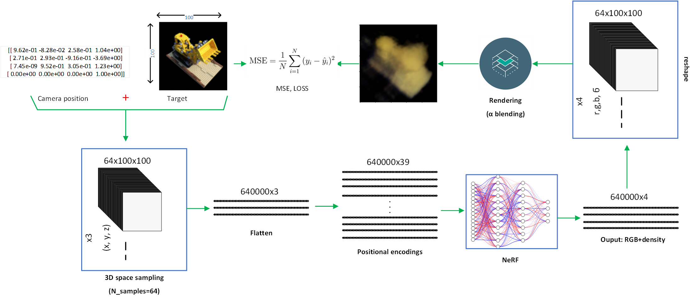
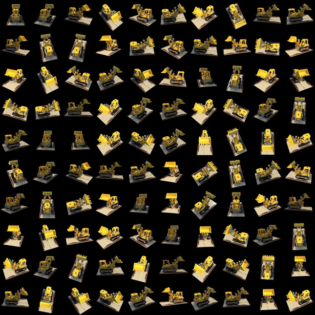

# Understanding NeRF in a small scale

### [Medium Article]() | [](Changelog.md) | [](https://github.com/iFarhat93/tiny_pytorch_nerf/issues)
| [](https://github.com/iFarhat93/tiny_pytorch_nerf/pulls)

This repository is currently under development. Features and functionalities may be added or improved in the future.



## Quickstart

To set up a conda environment and begin the training process for the lego data, use the following commands:

```bash
conda env create -f environment.yml
conda activate tiny_pytorch_nerf

python main.py --npz_file ../data/lego.npz --N_samples 64 --pos_enc 8 --N_iter 1000 --save_pts 100 --width 512 256 128 128 64 --batch_norm False --dropout False

tensorboard --logdir=../logs/lego --port=6006

``` 
If everything works without errors, you can now go to `localhost:6006` in your browser and watch the "lego" scene train.

## Help explained
```bash
usage: main.py [-h] --npz_file NPZ_FILE [--N_samples N_SAMPLES] [--N_iter N_ITER] [--save_pts SAVE_PTS] [--width [WIDTH [WIDTH ...]]]
               [--pos_enc POS_ENC] [--batch_norm BATCH_NORM] [--dropout DROPOUT]

Input samples for the training process.

optional arguments:
  -h, --help            show this help message and exit
  --npz_file NPZ_FILE   Compressed input numpy file containing: images, poses, and focal info
  --N_samples N_SAMPLES
                        Number of samples in the 3D space (default: 64)
  --N_iter N_ITER       Number of training iterations (default: 1000)
  --save_pts SAVE_PTS   Save model every N iterations (default: 100)
  --width [WIDTH [WIDTH ...]]
                        List of model widths (default: [512, 256, 128, 64, 32, 16, 8])
  --pos_enc POS_ENC     Positional encodings dimension (default: 6)
  --batch_norm BATCH_NORM
                        enable batch normalization (default: False)
  --dropout DROPOUT     enable dropout (default: False)

  ```

The implementation is flexible for users to manipulate by changing the model depth/width, batch normalization, dropout, change the positional encodings, change the dropout and the total number of iteration.

# Visualization of Input and Output

## Input



This image shows a subset of the Lego dataset, specifically 100 images that have been resized to 100x100 pixels. These images serve as the input data for training the tiny_pytorch_nerf.

## Output


A continuous rendering of a 360-degree view of the Lego dataset after a number of training steps.


## Collaboration

We welcome collaborations from the community! If you're interested in contributing to this educational NeRF, please review our contributing guidelines and send us a pull request or open an issue.

## Future work
Build a more small scale 3D recontruction models for educational perpose. Next we try to replace the NN with ViT and evaluate the result, stay tuned...
